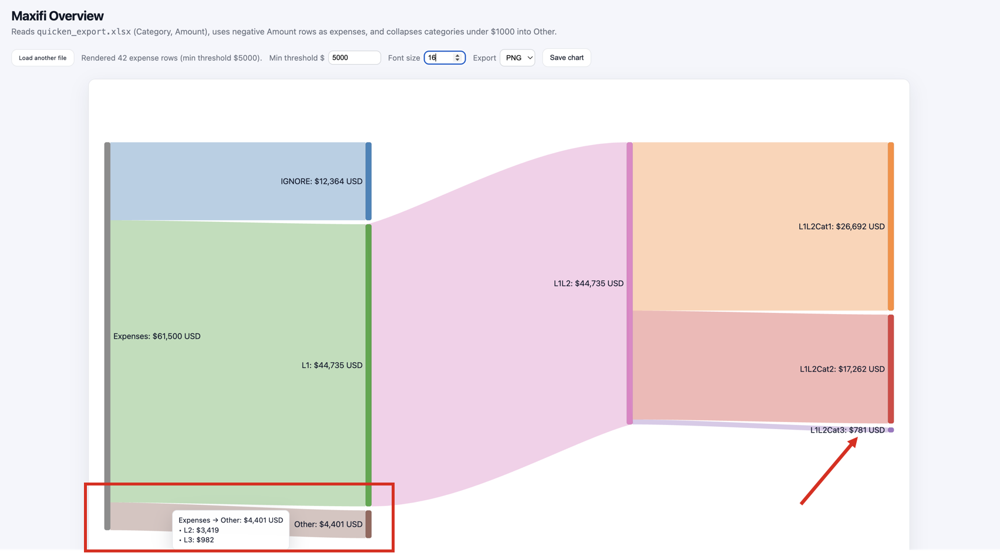
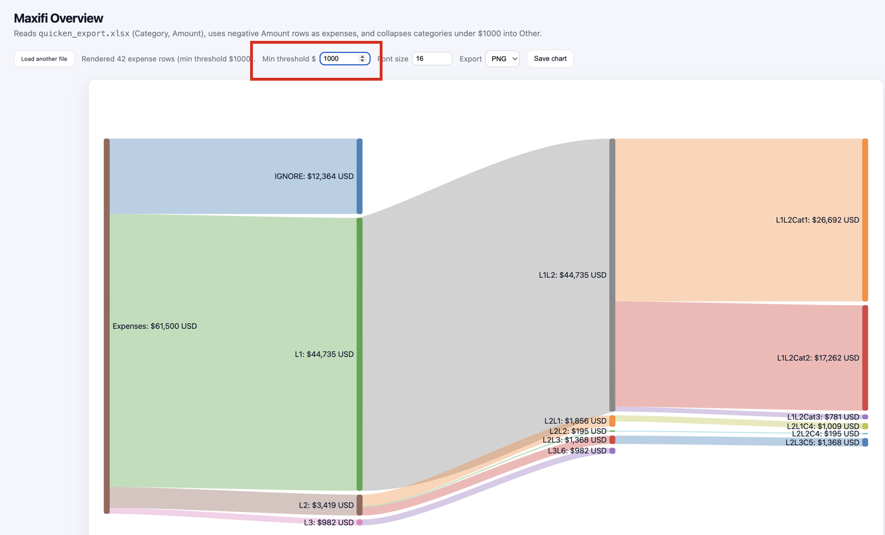
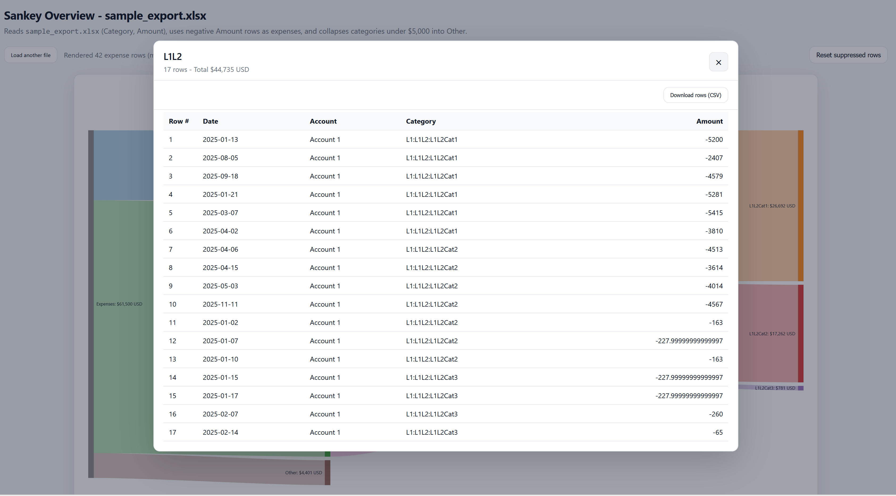
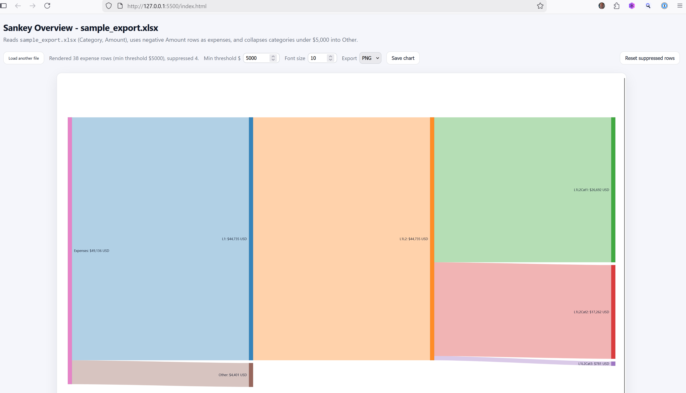

# Quicken_Sankey
D3-based Sankey diagram for Quicken transactions

## Table of Contents
- [What it does](#what-it-does)
- [Brief instructions](#brief-instructions)
- [What you get](#what-you-get)


## What it does


Uses a D3-based index.html file that reads an XLSX export from Quicken transactions to generate an interactive Sankey diagram based on expense categories and subcategories as defined in Quicken. 

### Features

1. Auto-generates category-subcategory hierarchy by parsing Quicken-specific colon-separated Categories.
2. Renders height of a node element and the thickness of a flow/link element to be proportional to the total Expenses.
3. Allows for dynamic setting of MIN_VIZ variable, which determines the lowest amount to be displayed. Any flows with amount less than MIN_VIZ is rolled up into a aggregated "Other" node. The exception is if there is only a single node to be aggregated, that node is displayed.
4. Allows for dynamic setting of font size.
5. Dynamically suppresses a data flow and all downnstream children and dynamically reinstates all supporessed data flows.
6. Downloads Sankey chart as SVG or PNG into browser download folder.
7. Downloads node-level raw data rows as CSV into browser download folder.

### Limitations
1. Reader initial default filename is "quicken_export.xlsx" but can be changed using "Load another file" button.
2. Reader explicilty uses only "Category" and "Amount" columns. All other extracted columns are ignored
3. The current rendering does not eliminate all flow/link overlaps. I gave up trying to completely eliminate them.
4. Read acknowledgements

### Acknowledgements
I am not an HTML/CSS/JS programmer. I am an SQL programmer. I used OpenAI's ChatGPT via VSC's CODEX plugin to write all of this code. It was a real struggle getting the tool to create the program that I wanted. I had to start over multiple times. And it often generated invalid code. Even so, since I did not have even basic HTML/CSS/JS knowledge, I could not have created this tool without ChatGPT. That said, I am sure there is a lot of redundant and/or inefficient and/or convoluted code that a skilled web programmer could greatly improved. If you are one of these people, please feel free to dig in and clean up the ChatGPT-generated code. I simply am too ignorant of this environment to do this myself.

### TODOs
1. See issues tracker.

## Brief instructions
The input reader is very specific to Quicken's output format, especially how category hierachies are represented as a colon-delimited string in a Category column. Only uses Category and Amount fields (column names are hard-coded). The initial file name is also hard coded as quicken_export.xlsx but this can be changed using the "Load another file" button in upper left side. I made no attempt to generalize the input reader.

1. To create the required XLSX in Quicken, create a custom Transaction report. I use the following options for my output:
   - Date Range (top dialog box): Year to Date
   - Sort by: Category
   - Columns: Date, Account, Category, Amount. The reader doesn't use Date and Account but I include them for debugging.
   - Accounts: No Investment accounts, only Banking accounts
   - Categories: All
   - Payees: All
   - Securities: Clear all (no securities included)
   - Advanced: Transfer: Exclude all ; Subcategories: Show all

2. Run the report. In Quicken, report should look like this:


3. Export the report as XLSX and save in the same directory as the index.html file. The default filename expected by the reader is quicken_export.xlsx


**WARNING: Quicken adds header and footer rows for titles and summary data to the XLSX that must be MANUALLY removed. The final spreadsheet should only have one workbook, Row 1 as headers, Rows2-N as single transactions. See quicken_sample.xlsx for final format.**

4. Save the modified XLSX.

5. Start the included Flask server in a separate Python virtual environment so the browser can fetch the XLSX:
   ```
   python -m venv .venv
   source .\.venv\Scripts\activate (PC); source ./.venv/bin/activate (Mac)
   pip install -r requirements.txt
   python app.py
   ```
   Then open http://localhost:5000/ in your browser.

6. If you do not want to use Python/virtual environments, start a local web server (search Google). I use LiveServer in Visual Studio Code (VSC). Then click on index.html

## What you get
Rename the provided sample_export.xlsx to quicken_export.xlsx and launch your local web server as described above. The inital chart using the current hard-coded defaults looks like:


Note the default values for min threshold ($5000 -- I know, the subheader in the screen shot says $1000. This has been fixed. The real default is $5000) and font (10) (red box). Any categories that are less than $5000 (and are not singleton categories) are rolled up into an aggregated "Other" node (red arrow).

Because it is hard to read the node labels, let's increase the font to 16. 



This display also shows that hovering over an "Other" node shows the two children nodes and their amounts that were aggregated together (red box). Notice that both of them are less than the Min Threshold value, even though the sum of the aggregated nodes might eventually exceed the minimum.

The red arrow shows a category that also is less than the minimum threshold yet it is not aggregated into an "Other" node. This is because it was the only node (a singleton) to be aggregated. Singleton nodes are displayed "as is", otherwise the "Other" node would only contain one node.



This screen shot shows changes due to lowering the minimum threshold to $1000. Nodes that previously were aggregated are now visible. Note that there are multiple nodes with amounts less than the threshold. These are not aggregated into an "Other" node because they are singleton nodes.

**HOVERING** over a flow/link shows source and target node plus amount, which is also readily discernable from the chart. Link hovering is more useful for "Other" links, which show all of the individual children nodes and their amounts that got rolled up into the "Other" node. At this time, there is no hovering behavior for data nodes.

**RIGHT clicking** on any data node generates a popup table containing the raw data rows at this node and all children data nodes. All columns from the raw data file are included. The "download rows" button on the top right side of the table downloads the CSV into the browser's download folder. **LEFT clicking** on a data nodes does nothing (currently).



**RIGHT clicking** on any flow/link brings up a dialog box that allows you to remove (suppress) the data in that flow and all downstream children flows. The "Reset suppressed rows" button in the upper right corner brings back ALL suppressed rows. There is no way to bring back a selected subset of suppressed data.  **LEFT clicking** on a flow/link does nothing (currently). 

To reinstate suppressed flows, click "Reset suppressed rows" button in upper right corner. Or, simply refresh the entire web page using the browser's refresh button.


After suppression, Sankey chart is redrawn:



