# Quicken_Sankey
D3-based Sankey diagram for Quicken transactions

## Table of Contents
- [What it does](#what-it-does)
- [Brief instructions](#brief-instructions)
- [What you get](#what-you-get)


## What it does


Reads an XLSX export file created by a Quicken-generated transaction report to generate an interactive Sankey diagram. The display expense categories and subcategories are defined in the Quicken report. 

The current version only displays expense transactions. There are no immediate plans to create a similar display of income or investment transactions.

The Sankey diagram is generated by a JavaScript D3-based index.html file that reads the XLSX file, renders the Sankey chart, and manages the interactive features described below. To run this tool, you need a local web server. A Python-based program (app.py/requirements.txt) is provided. Else you can use the "Live Server" plug-in for VSC (my preferred method) or any other method of launching a local web server.

### Features

1. Generates the Quicken category-subcategory hierarchy by parsing Quicken-specific colon-separated Categories.
2. Renders the height of a node element and the thickness of a flow/link element to be proportionate to the total Expenses.
3. Supports dynamic setting of MIN_VIZ variable, which determines the lowest amount to be displayed. Any source with amount less than MIN_VIZ is rolled up into a aggregated "Other" node. The exception is if there is only a single source to be aggregated, that source is displayed.
4. Supports dynamic setting of font size.
5. Suppresses a data flow and all downnstream children and dynamically reinstates all supporessed data flows.
6. Downloads Sankey chart as SVG or PNG into browser download folder.
7. Displays node-level raw data rows as pop-up data table that can be sorted ascending/descending by clicking on any column. Initial sort order is Category-ascending.
8. Downloads pop-up data table as CSV into browser download folder using current sort order.

### Limitations
1. Reader initial default filename is "quicken_export.xlsx" but can be changed using "Load another file" button (see Brief Instructions).
2. Reader explicilty uses only "Category" and "Amount" columns as defined in Quicken transaction export file. All other columns that are included in the Quicken transaction report are ignored but are made available in the raw data extract for debugging purposes.
3. Chart renders expenses transactions only.
4. The current rendering does not eliminate all flow/link visual overlaps. I gave up trying to completely eliminate them.
5. Data table sorting limited to only one column ascending/descending.
5. Changes to MIN_VIZ, font, and open file are not retained across sessions.
6. Read acknowledgements

### Acknowledgements
I am not an HTML/CSS/JS programmer. I am an SQL programmer. I used OpenAI's ChatGPT via VSC's CODEX plugin to write all of this code. It was a real struggle getting the tool to create the program that I wanted. I had to start over multiple times. And it often generated invalid code. Even so, since I did not have even basic HTML/CSS/JS knowledge, I could not have created this tool without ChatGPT. That said, I am sure there is a lot of redundant and/or inefficient and/or convoluted code that a skilled web programmer could greatly improved. If you are one of these people, please feel free to dig in and clean up the ChatGPT-generated code. I simply am too ignorant of this environment to do this myself.

### TODOs
1. See Github issues tracker.

## Brief instructions
The input reader is very specific to Quicken's output format, especially how category hierachies are represented in Quicken as a colon-delimited string in a Category column. Only uses Category and Amount fields (column names are hard-coded). The initial file name is also hard coded as quicken_export.xlsx but this can be changed using the "Load another file" button in upper left side. I made no attempt to generalize the input reader.

1. To create the required XLSX in Quicken, create a custom Transaction report. I use the following options for my output:
   - Date Range (top dialog box): Year to Date
   - Sort by: Category
   - Columns: Date, Account, Category, Amount. The reader doesn't use Date and Account but I include them for debugging.
   - Accounts: No Investment accounts, only Banking accounts
   - Categories: All
   - Payees: All
   - Securities: Clear all (no securities included)
   - Advanced: Transfer: Exclude all ; Subcategories: Show all

2. Run the report. In Quicken, report should look like this:

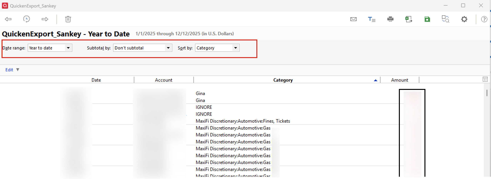

3. Export the report as XLSX and save in the same directory as the index.html file. The default filename expected by the reader is quicken_export.xlsx but you can name this file anything but must end in XLSX.

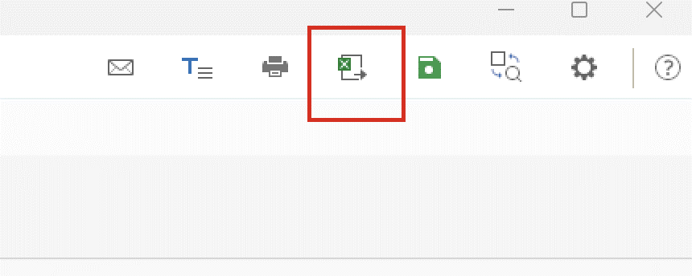

**WARNING: Quicken adds header and footer rows for titles and summary data to the XLSX that must be MANUALLY removed. The final spreadsheet should only have one workbook, Row 1 as headers, Rows2-N as single transactions. See quicken_sample.xlsx for final format.**

4. Save the modified XLSX with the extraneous header/footer rows removed.

5. Start the included Flask server in a separate Python virtual environment so the browser can fetch the XLSX:

   DO THIS ONLY ONCE TO SET UP VIRTUAL ENVIORNMENT
   ```
   python -m venv .venv
   source .\.venv\Scripts\activate (PC); source ./.venv/bin/activate (Mac)
   pip install -r requirements.txt
   ```

   DO THIS EACH SESSION
   ```
   source .\.venv\Scripts\activate (PC); source ./.venv/bin/activate (Mac)
   python app.py
   ```
   Then open http://localhost:5000/ in your browser.

6. If you do not want to use Python/virtual environments, start a local web server (search Google). I use LiveServer in Visual Studio Code (VSC). Click on index.html

## What you get

If you do not have a file named quicken_export.xlsx in the same directory as index.html, you will get this initial page. Use the "Load another file" in the upper left corner to use your XLSX.

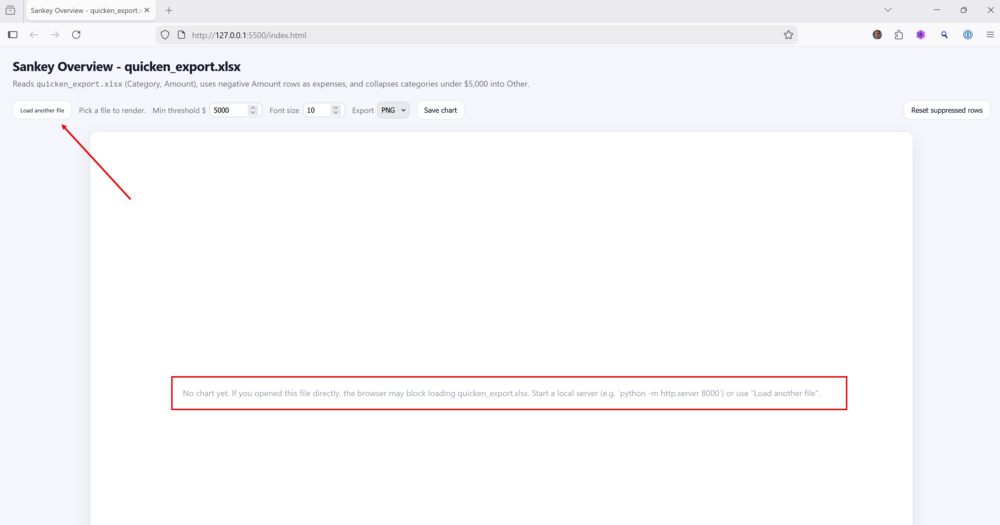

Using the "Load another file" button, load the provided sample_export.xlsx, you should get an initial chart that uses the hard-coded defaults for "Min threshold" and "Font size":


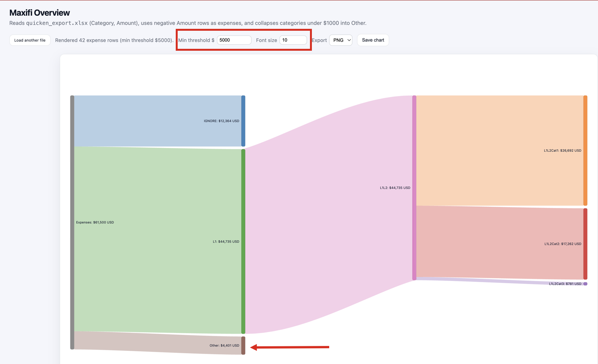

Note the default values for min threshold ($5000) and font (10) (red box). Any categories that are less than $5000 (and are not singleton categories) are rolled up into an aggregated "Other" node (red arrows).
Note that the sum of categories in an "Other" node can exceed the min threshold. The min threshold applies to each category separately (more below)

Because it is hard to read the node labels, let's increase the font to 16. 

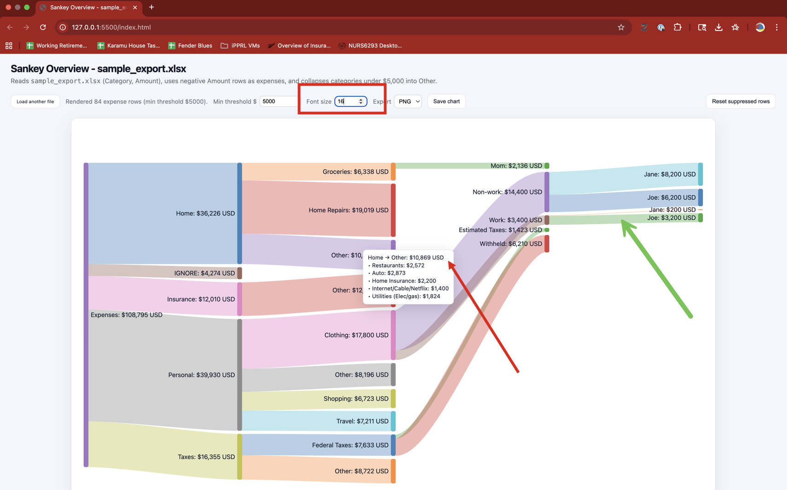

This display also shows that hovering over an "Other" node shows the five children nodes and their amounts that were aggregated together (red arrow). Notice that all aggregated amounts are less than the Min Threshold value, even though the sum of the aggregated nodes eventually exceeds the minimum ($10,869).

The green arrow shows a category that is less than the minimum threshold ($3,200) yet it is not aggregated into an "Other" node. This is because it was the only node (a singleton) to be aggregated. Singleton nodes are displayed "as is", otherwise the "Other" node would only contain one node.


The next two screen shots show the changes caused by lowering the minimum threshold to $2,500 and $1,000 respectively. Nodes that previously were aggregated into a single "Other" node are now visible as distinct flows/links due to the lower min threshold. 

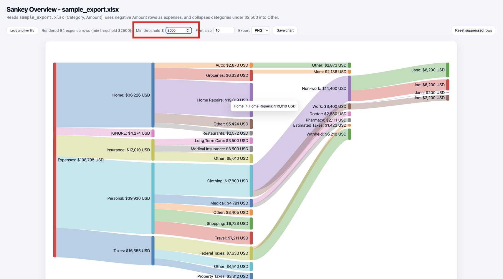

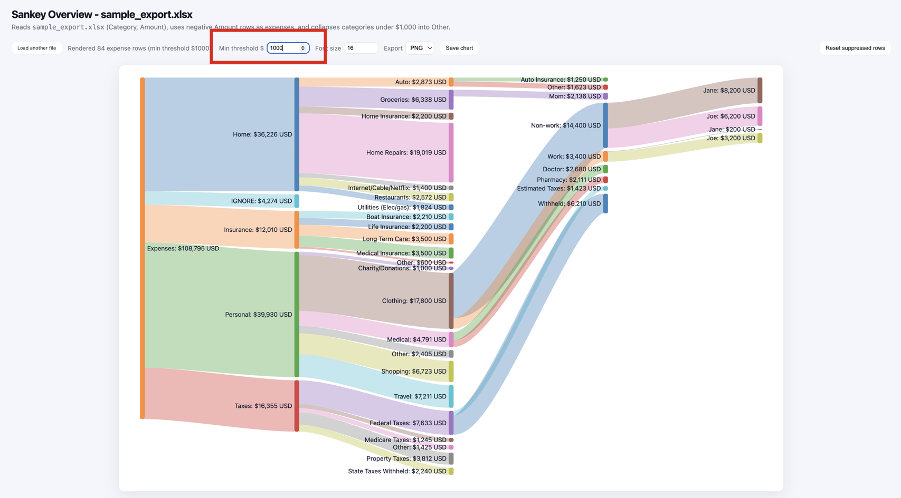

## Interactions

**HOVERING** over a flow/link shows source and target node plus amount, which is also readily discernable from the chart. Hovering is more useful for "Other" links, which show all of the individual children nodes and their amounts that got rolled up into the "Other" node.

There is no hovering behavior for data nodes.

---

**LEFT clicking** on a data nodes does nothing (currently).

**RIGHT clicking** on a data node generates a pop-up table containing the raw data rows contained this node and all children data nodes (red arrows/boxes). 

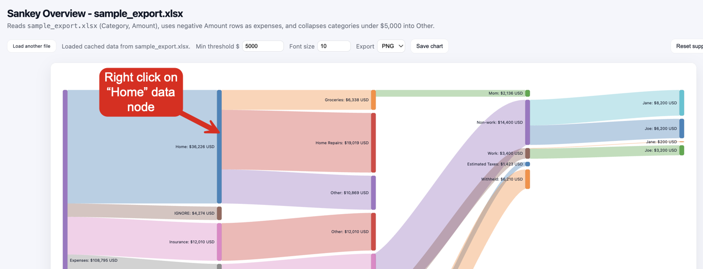


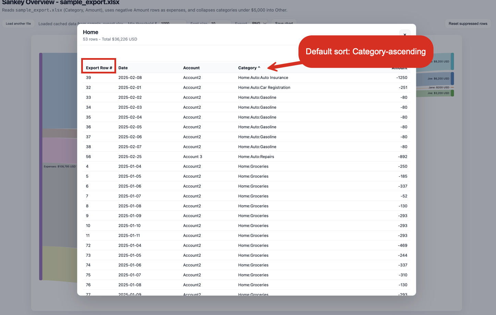


All columns from the raw data file are included. The "Export Row #" (red box) is the original row number from the Quicken XLSX file (red box). The default sort order is by Category-ascending as noted by the up-caret.

The next two figures show changing the sort order to Amount-ascending (most negative expenses to least negative expenses) and Amount-descending (least negative to most negative) by clicking on the column header. 

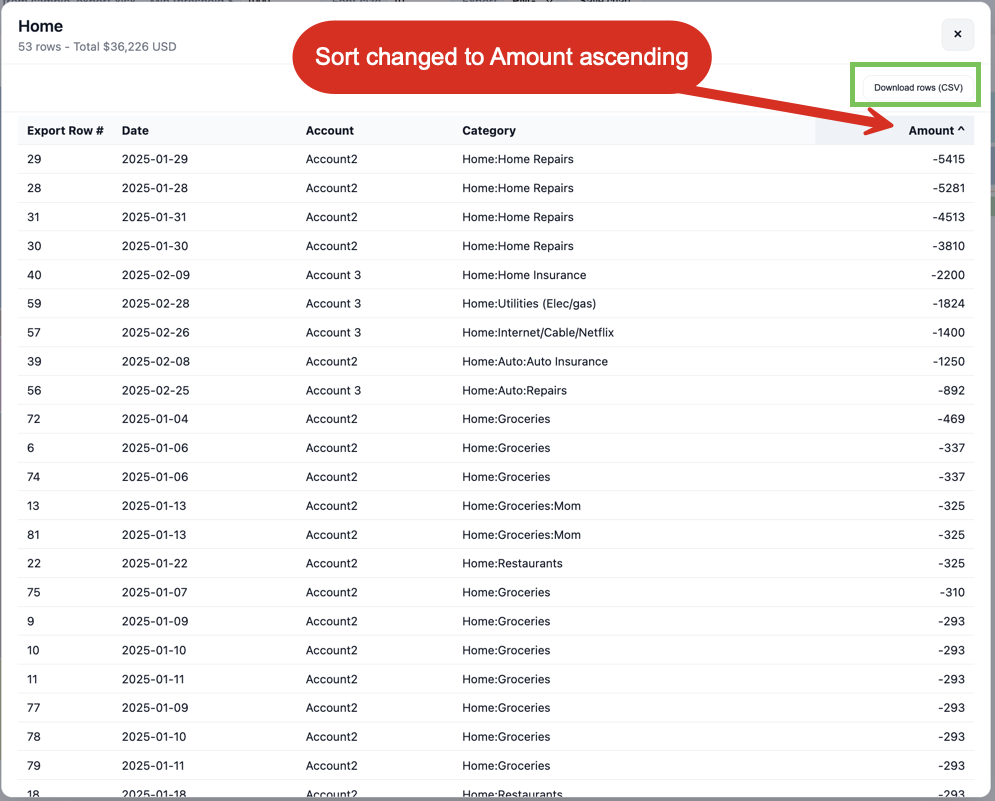

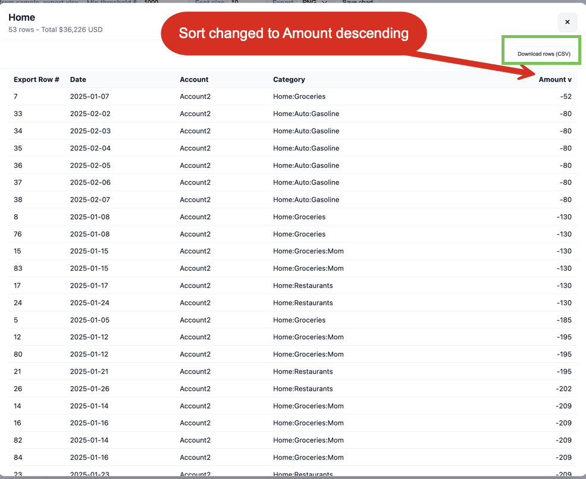


The "download rows" button on the top right side of the table (green box) downloads the CSV into the browser's download folder. The CSV retains the current sort order.

---

**LEFT clicking** on a flow/link does nothing (currently). 

**RIGHT clicking** on any flow/link brings up a dialog box that allows you to remove (suppress) the data in that flow and all downstream children flows. This example right-clicks on the Taxes flow. Clicking "OK" removes all transactions associated with that category and all children subcategories. The Sankey chart is redrawn with these transactions removed. Suppression can be applied at any level in the category hierarchy.

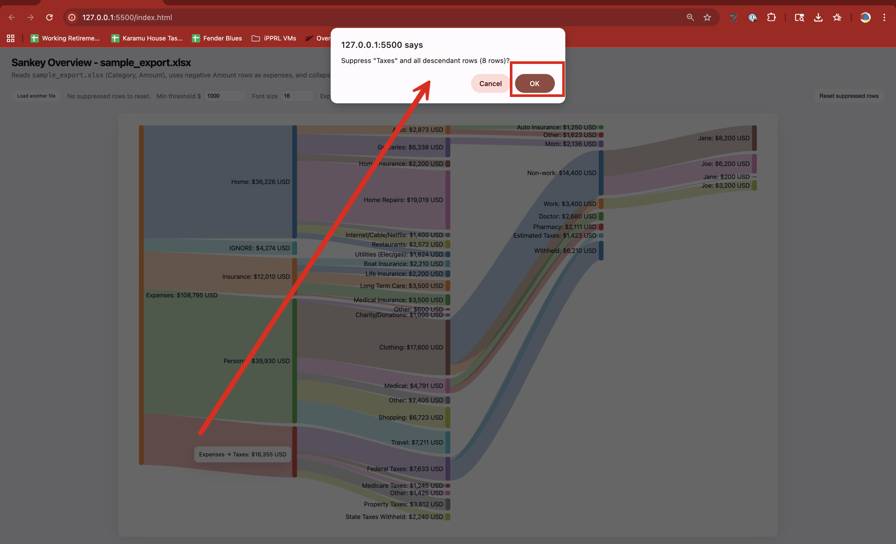

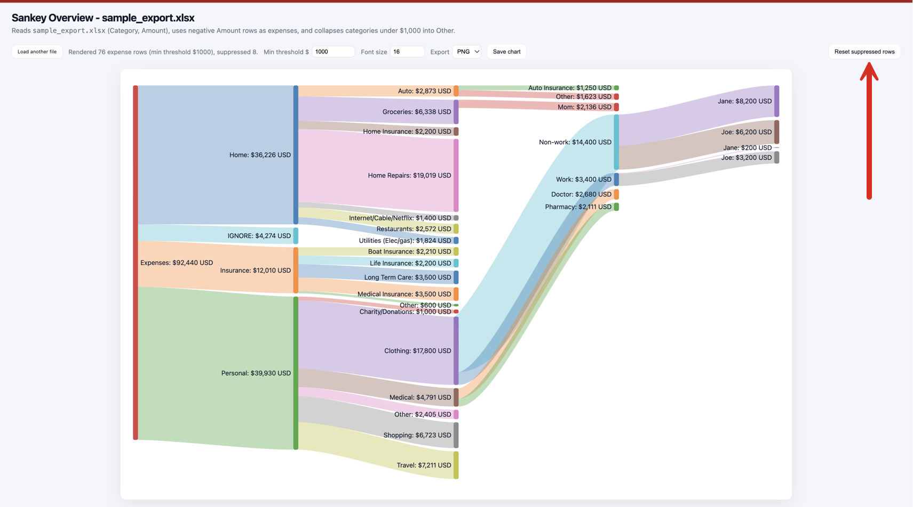


To reinstate suppressed flows, click "Reset suppressed rows" button in upper right corner (red arrow). Or, simply refresh the entire web page using the browser's refresh button.

You cannot select which suppressed rows to reinstate. Currently this is an all-or-none function. The full original Sankey chart will be recreated. Reinstating suppressed rows will not alter any changes made to min threshold and font size.

---

You can save the current Sankey chart as either a PNG or SVG file. Only the main chart is saved. If rows have been suppressed, the revised version of the chart, with the suppressed data removed, will be saved.


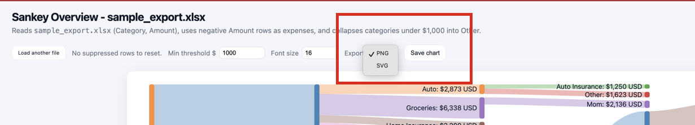

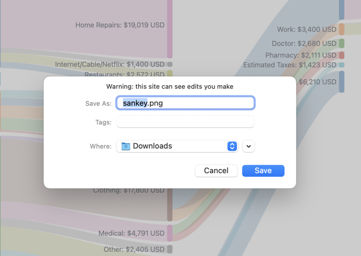

To print the entire Sankey page that includes the filename  and min viz/font settings, use the browser's native print function.


---

__EOF__

---

